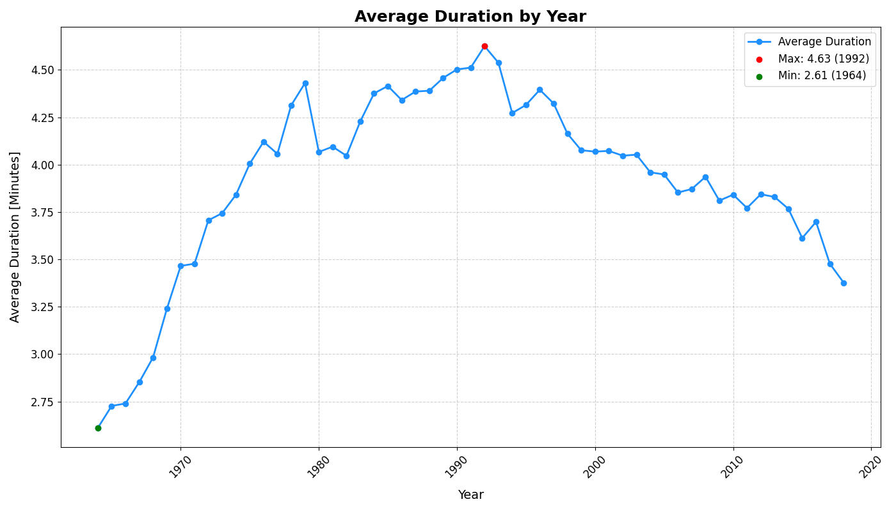
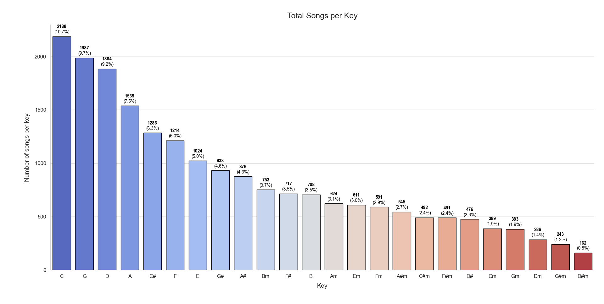
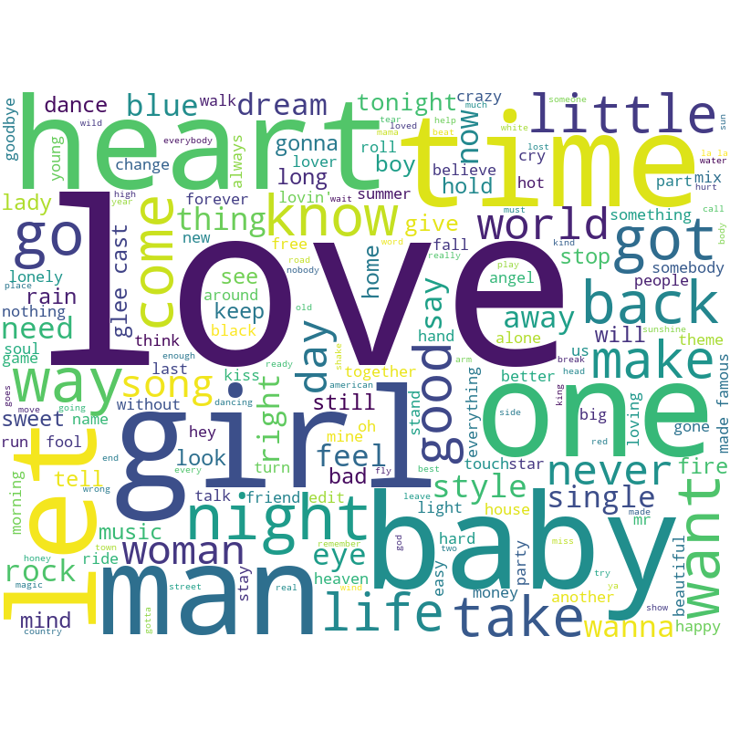
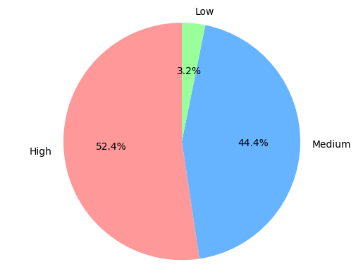

# Example queries
Below, we describe what we believe are the most interesting queries we performed on our graph database.  
Through these queries, we aimed to uncover some insights from the data and gather statistics that could be useful, for instance, to song producers and professionals in the music industry.

## Top 10 songs
This query extracts the most popular songs in the whole database. The popularity of a song is based on the number of times it appears in the first 10 positions of a Billboard.

    PREFIX mel: <http://www.dei.unipd.it/~gdb/ontology/melody#>
    PREFIX xsd: <http://www.w3.org/2001/XMLSchema#>

    SELECT ?title ?artistName (COUNT(?position) AS ?totalAppearancesInTheFirst10Pos)WHERE {
        ?song a mel:Song ;
                mel:name ?title ;
                mel:classified ?membership ;
                mel:sungBy/mel:name ?artistName .

        ?membership a mel:Membership ;
                    mel:position ?position ;
                    mel:classifiedIn ?billboard .
                
        FILTER(?position <= "10"^^xsd:positiveInteger) . 
    }
    GROUP BY ?title ?artistName
    ORDER BY DESC (?totalAppearancesInTheFirst10Pos)
    LIMIT 10

| Song Title | Artist Name | Appearances
|------------|------------|-----------|
| Shape of You |Ed Sheeran |33|
How Do I Live |LeAnn Rimes |32|
Smooth (As Made Famous By SantanaFeaturing Rob Thomas)| The Karaoke Crew |30|
That’s What I Like| Bruno Mars |28|
Perfect|Ed Sheeran |27|
God’s Plan| Drake| 26|
Truly Madly Deeply| Savage Garden |26|
Apologize| OneRepublic| 25|
Counting Stars| OneRepublic |25|
Trap Queen| Fetty Wap |25|

## Evolution of songs duration over the years
This query examines the evolution of song duration over the years. Specifically, for each year, we calculated the
average song duration of the songs featured in the Billboard Hot 100. Since the exact release year of each song is
not in the database (see the [Ontology design diagram](../OntologyDesign/melody_ontology.png)), we used the year in which the song first appeared on the
Billboard chart as a proxy for its release year.

    PREFIX mel: <http://www.dei.unipd.it/~gdb/ontology/melody#>

    SELECT ?year ((AVG(?duration)/1000)/60 AS ?avgDurationMinutes) WHERE {
        {
            SELECT ?song (MIN(?billboardYear) AS ?year) WHERE {
                ?song a mel:Song ;
                        mel:name ?songTitle ;
                        mel:classified ?membership .

                ?membership a mel:Membership ;
                                mel:classifiedIn ?billboard .

                ?billboard a mel:BillboardHot100 ;
                            mel:date ?date .

                BIND(YEAR(?date) AS ?billboardYear) .
            }
            GROUP BY ?song
        }
        
        ?song mel:duration ?duration .
    }
    GROUP BY ?year
    ORDER BY DESC (?year)

## Song by key
This query counts the number of songs in each musical key. The results are quite interesting, as we observe a significant number of songs in the key of C and very few in D# minor.

    PREFIX mel: <http://www.dei.unipd.it/~gdb/ontology/melody#>

    SELECT ?key ?count (((?count*100)/?tot_songs) AS ?percentage) WHERE {
        {
            SELECT ?key (COUNT(*) AS ?count) WHERE {
                ?song a mel:Song ;
                        mel:key ?key .
            }
            GROUP BY ?key
        }
        {
            SELECT (COUNT(*) AS ?tot_songs) WHERE {
                ?song a mel:Song .
            }
        }
    }
    ORDER BY DESC (?count)

## Major vs minor scale
As you can observe from the ASK query below, the number of major key songs is more than twice the number of minor key songs. This might suggest that songs in the major scale are more likely to appear on the Billboard charts. However, this is purely speculative, since we do not have information about songs not in the Billboard Hot 100 charts.

    PREFIX mel: <http://www.dei.unipd.it/~gdb/ontology/melody#>

    ASK WHERE {
        {
            SELECT (COUNT(*) AS ?minorKeySongs) WHERE {
                ?song a mel:Song ;
                        mel:key ?key .
                
                FILTER(REGEX(?key, "m$")) .
            }
        }
        {
            SELECT (COUNT(*) AS ?majorKeySongs) WHERE {
                ?song a mel:Song ;
                        mel:key ?key .
                
                FILTER(REGEX(?key, "^(?!.*m$)")) .
            }
        }
        FILTER(?majorKeySongs > ?minorKeySongs*2) .
    }

    # ANSWER: YES

## Song titles word-cloud
To analyze the most frequently occurring words in song titles, we wrote a query that concatenates all the song titles into a single string, converting uppercase letters to lowercase.

    PREFIX mel: <http://www.dei.unipd.it/~gdb/ontology/melody#>

    SELECT (GROUP_CONCAT(LCASE(?songTitle); SEPARATOR=" ") AS ?allSongTitles) WHERE {
        ?song a mel:Song ;
                mel:name ?songTitle .
    }

## Occurrences of the word *love* in song titles
This query counts the number of song titles in which occurs the word *love*. 

    PREFIX mel: <http://www.dei.unipd.it/~gdb/ontology/melody#>
    SELECT (COUNT(*) AS ?songWithLOVEInTheTitle) WHERE {
        ?song a mel:Song ;
                mel:name ?songTitle .
        
        FILTER(REGEX(LCASE(?songTitle), "\\blove\\b")) .
    }

    # ANSWER: 1643

## One-Hit Wonders (The Musical Comets)
This query aims to identify artists who experienced a short moment of glory in the Top 50 of the Billboard charts. The query searchs for artists who had at least one song reach the Top 50 but never appeared in the Billboard charts again with any other song, even outside the Top 50.

    PREFIX mel: <http://www.dei.unipd.it/~gdb/ontology/melody#>

    SELECT ?artistName ?songName ?position WHERE {
    ?song mel:name ?songName ;
            mel:sungBy/mel:name ?artistName ;
            mel:classified ?membership .
    ?membership mel:position ?position .
    FILTER (?position < 51)

    FILTER NOT EXISTS {
        ?song2 mel:sungBy/mel:name ?artistName ;
                    mel:classified ?membership2 .
        FILTER (?song2 != ?song)
    }

    FILTER NOT EXISTS {
        ?song mel:name ?songName ;
            mel:sungBy/mel:name ?artistName ;
            mel:classified ?membership3 .
        ?membership3 mel:position ?position2 .
        FILTER (?membership3 != ?membership)
    }
    }
    GROUP BY ?artistName ?songName ?position 
    ORDER BY(?position)

| Song Title                                        | Artist Name                                           | Peak Position |
| ------------------------------------------------- | -------------------------------------------------------- | -------------: |
| We Might Be Dead By Tomorrow                     | Soko                                                     | 9             |
| Wasted Love                                       | Matt McAndrew                                             | 14            |
| Hey soul sister                                  | Glee Cast Karaoke's band                                 | 29            |
| 3AM (as made famous by Eminem)                   | Radio Killers                                            | 32            |
| My Baby’s Got A Smile On Her Face                | Craig Wayne Boyd                                         | 34            |
| (There's No Place Like) Home for the Holidays      | Mitchell Ayres & His Orchestra                            | 41            |
| Wonderful Summer                                   | Robin Ward                                                | 43            |
| Hold Up My Heart                                 | Brooke White                                              | 47            |
| Wonderful Christmastime                           | Jimmy Fallon                                             | 47            |
| White Christmas                                   | Ken Darby Singers & Bing Crosby & John Scott Trotter & His Orchestra  | 48            |
| Christmas (Baby Please Come Home)                 | Darlene Love                                              | 50            |

## Comeback Songs
This query explores the phenomenon of "comeback" songs, tracks that initially appeared on the Billboard charts, disappeared, and then made a reappearance at least a decade later.

    PREFIX mel: <http://www.dei.unipd.it/~gdb/ontology/melody#>

    SELECT DISTINCT ?songName ?artist ?earliestYear (YEAR(?date2) AS ?returnYear) (?returnYear - ?earliestYear AS ?distance)
    WHERE {
    ?song mel:name ?songName ;
            mel:classified ?membership2 .

    ?membership2 a mel:Membership ;
                mel:classifiedIn ?billboard2 .
    ?billboard2 mel:date ?date2 .

    {
        SELECT ?songName ?artist (MIN(YEAR(?date1)) AS ?earliestYear)
        WHERE {
        ?song mel:name ?songName ;
                mel:classified ?membership1 ;
                mel:sungBy ?art.
        ?art mel:name ?artist.
        ?membership1 a mel:Membership ;
                    mel:classifiedIn ?billboard1 .
        ?billboard1 mel:date ?date1 .
        }
        GROUP BY ?songName ?artist
    }

    FILTER (YEAR(?date2) > ?earliestYear)
    FILTER (YEAR(?date2) - ?earliestYear >= 10)
    }
    ORDER BY DESC(?distance) ?songName ?artist ?earliestYear ?returnYear

| Song Name | Artist | Earliest Year | Return Year | Distance |
|---|---|---|---|---|
| Money | The Kingsmen | 1964 | 2018 | 54 |
| Stay | Frankie Valli & The Four Seasons | 1964 | 2018 | 54 |
| Tequila | Bill Black's Combo | 1964 | 2018 | 54 |
| Try Me | Jimmy Hughes | 1964 | 2018 | 54 |
| Alone | Frankie Valli & The Four Seasons | 1964 | 2017 | 53 |
| Everybody | Tommy Roe | 1964 | 2017 | 53 |
| This Is It | Jim Reeves | 1965 | 2018 | 53 |
| Today | The New Christy Minstrels | 1964 | 2017 | 53 |
| Alone | Frankie Valli & The Four Seasons | 1964 | 2016 | 52 |
| Love Me Now | Brook Benton | 1965 | 2017 | 52 |

## Album Excellence
This query identifies albums with a significant concentration of Grammy-nominated or winning songs, calculating the percentage of tracks within albums that contain more than two songs and that feature at least two Grammy-recognized songs.

    PREFIX mel: <http://www.dei.unipd.it/~gdb/ontology/melody#>

    SELECT distinct ?albumName ?totTracks ?artistName
        (COUNT(distinct ?song) as ?songPerAlbum)
        ((COUNT(distinct ?song) / ?totTracks) * 100 AS ?grammyPercentage)
        (GROUP_CONCAT(distinct ?songName; SEPARATOR=", ") AS ?grammySongs)
    WHERE {
        ?song a mel:Song;
            mel:winner|mel:candidated ?grammy;
            mel:name ?songName;
            mel:sungBy ?artist.
        ?artist mel:name ?artistName.
        ?album mel:containsSong ?song;
            mel:name ?albumName;
            mel:totalTracks ?totTracks.
        FILTER(?totTracks>2)
    }
    GROUP BY ?albumName ?artistName ?totTracks
    HAVING(?songPerAlbum >1)
    ORDER BY DESC(?grammyPercentage)

| Album Name                       | Total Tracks | Artist Name         | Songs Per Album | Grammy Percentage | Grammy Songs                                                   |
|-----------------------------------|--------------|----------------------|-----------------|-------------------|-----------------------------------------------------------------|
| Hotel California (2013 Remaster) | 9            | Eagles               | 2               | 22.2\%          | Hotel California - 2013 Remaster, New Kid in Town - 2013 Remaster |
| 24K Magic                      | 9            | Bruno Mars           | 2               | 22.2\%          | That's What I Like, 24K Magic                                   |
| From A Room: Volume 1          | 9            | Chris Stapleton      | 2               | 22.2\%          | Broken Halos, Either Way                                          |
| Clapton Chronicles: The Best of Eric Clapton | 14           | Eric Clapton         | 3               | 21.4\%          | Bad Love, Change the World, Tears in Heaven                  |
| Viva La Vida or Death and All His Friends | 10           | Coldplay             | 2               | 20.0\%          | Viva La Vida, Violet Hill                                       |
| True Colors                     | 10           | Cyndi Lauper         | 2               | 20.0\%          | What's Going On, Change of Heart                               |
| Talking Book                    | 10           | Stevie Wonder        | 2               | 20.0\%          | You Are The Sunshine Of My Life, Superstition                  |
| Soul Provider                   | 10           | Michael Bolton       | 2               | 20.0\%          | How Am I Supposed to Live Without You, Georgia On My Mind      |
| Minute By Minute                | 10           | The Doobie Brothers  | 2               | 20.0\%          | What a Fool Believes, Minute by Minute                         |
| Monkey Business                  | 16           | The Black Eyed Peas | 3               | 18.7\%          | My Humps, Don't Phunk With My Heart, Don't Lie                  |

## Top 10 Grammy-winning artists, including songs and albums
Our ontology divides the garmmy awards based on whether the category refers to a song, an album, or an artist. Knowing that a song is sung by an artist and that the artist has released an album, this query shows the artist with the highest number of Grammy wins also considering the songs and the albums. Note that the query does not precisely reflect the reality due to a dataset without well-defined fields that leads the team to do some simplification to the match logic between the Grammy and the winner.

    PREFIX mel: <http://www.dei.unipd.it/~gdb/ontology/melody#>

    SELECT ?name (SUM(?wins) AS ?totalWins)
    WHERE {
    {
        SELECT ?name (COUNT(?albumGrammy) AS ?wins)
        WHERE {
        ?a a mel:Artist ;
            mel:name ?name ;
            mel:releasedAlbum ?album .
        ?album mel:winner ?albumGrammy .
        }
        GROUP BY ?name
    }
    UNION
    {
        SELECT ?name (COUNT(?artistGrammy) AS ?wins)
        WHERE {
        ?a a mel:Artist ;
            mel:name ?name ;
            mel:winner ?artistGrammy .
        }
        GROUP BY ?name
    }
    UNION
    {
        SELECT ?name (COUNT(?songGrammy) AS ?wins)
        WHERE {
        ?artist a mel:Artist ;
            mel:name ?name ;
            mel:sing ?song .
        ?song mel:winner ?songGrammy .
        }
        GROUP BY ?name
    }
    }
    GROUP BY ?name
    ORDER BY DESC(?totalWins)
    limit 10

| name            | totalWins |
|-----------------|-----------|
| Stevie Wonder   | 19        |
| Eminem          | 14        |
| Adele           | 11        |
| Bruno Mars      | 11        |
| Aretha Franklin | 11        |
| Michael Jackson | 10        |
| Dixie Chicks    | 10        |
| Alicia Keys     | 10        |
| U2              | 9         |
| Foo Fighters    | 9         |

## Total Grammy wins per artist popularity
With this query the main focus is to check whether, given an artist, his or her popularity reflects the number of Grammys won. As we can see from the pie chart, this is verified: "High" popularity has a higher number of wins than "Medium" popularity, which, in turn, has a higher number of wins than "Low" popularity.

    PREFIX mel: <http://www.dei.unipd.it/~gdb/ontology/melody#>

    SELECT ?popularity (COUNT(?grammy) as ?totalGrammy) WHERE {
        ?artist a mel:Artist ;
            mel:hasPopularity ?popularity ;
            mel:winner ?grammy .
        {
            SELECT (COUNT(?grammy) as ?totGrammy) WHERE {
                ?artist a mel:Artist ;
                    mel:winner ?grammy .
            }
        }
    }
    GROUP BY ?popularity

## Average weeks on Billboard Hot 100 for artists with at least 10 songs
The idea of this query is to find out the average number of weeks an artist's song has been on the Billboard Hot 100 chart. In order to eliminate some misleading results in case an artist have one song or, in general, too few songs, the artist must have at least 10 songs that have been included in the Hot 100.

For brevity, in the results, we only show the top 10 artists with the highest average.

    PREFIX mel: <http://www.dei.unipd.it/~gdb/ontology/melody#>

    SELECT ?artistName (COUNT(?song) AS ?totalSongs) (AVG(?totalWeeks) as ?average) WHERE {
        ?artist a mel:Artist ;
            mel:name ?artistName ;
            mel:sing ?song .
        {
            SELECT ?song ?songName (COUNT(?billboard) as ?totalWeeks) WHERE {
                ?song a mel:Song ;
                    mel:name ?songName ;
                    mel:classified ?membership .
                ?membership mel:classifiedIn ?billboard .
            }
            GROUP BY ?song ?songName
            ORDER BY DESC(?totalWeeks)
        }
    }
    GROUP BY ?artistName
    HAVING (?totalSongs >= 10)
    ORDER BY DESC(?average)
    limit 10

| Artist Name         | Total Songs | Average                      |
|---------------------|-------------|------------------------------|
| Imagine Dragons     | 13          | 30.461538461538461538461538  |
| Bruno Mars          | 14          | 27.214285714285714285714286  |
| The Karaoke Crew    | 29          | 26.965517241379310344827586  |
| 3 Doors Down        | 10          | 26.8                         |
| Matchbox Twenty     | 10          | 26.5                         |
| OneRepublic         | 13          | 24.923076923076923076923077  |
| The Black Eyed Peas | 16          | 24.375                       |
| Destiny's Child     | 13          | 24.076923076923076923076923  |
| LeAnn Rimes         | 12          | 24.0                         |
| Adele               | 12          | 23.416666666666666666666667  |
