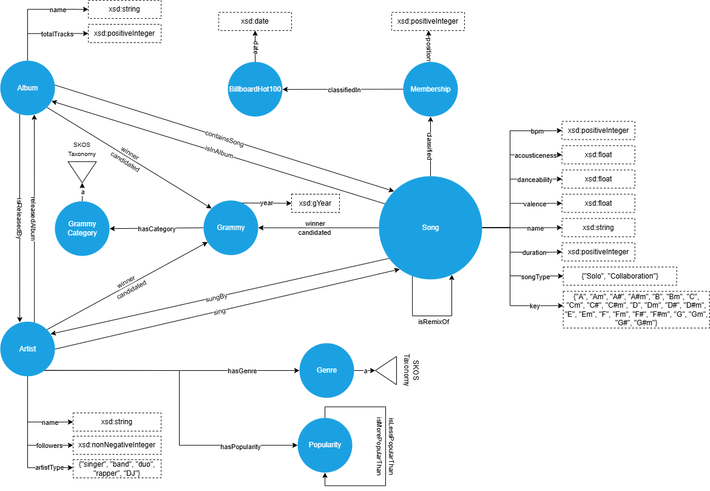

# MELODY
Repository of group *MELODY* for the "Graph Databases" course, A.Y. 2024/2025.

*Graph Databases* is a course of the [Master Degree in Computer Engineering](https://degrees.dei.unipd.it/master-degrees/computer-engineering/) of the  [Department of Information Engineering](https://www.dei.unipd.it/en/), [University of Padua](https://www.unipd.it/en/), Italy.

*Graph Databases* is part of the teaching activities of the [Intelligent Interactive Information Access (IIIA) Hub](http://iiia.dei.unipd.it/).

## Group members
| Surname    | Name       | email     |
|------------|------------|-----------|
| Di Martino | Ludovico   | ludovico.dimartino@studenti.unipd.it   |
| Galli      | Filippo    | filippo.galli@studenti.unipd.it   |
| Rigobello  | Manuel    | rigobello.manuel@studenti.unipd.it   |

## Project Description ###

The goal of the project is to create a graph database containing information about the most popular weekly songs from 1958 to the present. This data will be gathered from various [datasets](#dataset-used). With this information, it will be possible to make evaluations, for example, on song duration, key used, etc.

## Project structure
```
MELODY repository
│   
└───csv               # the csv datasets used
│  
└───OntologyDesign    # the ontology design diagram and turtle file
│  
└───PopulateRDFdb     # the python notebooks and output turtle files to populate the db
│   │
│   └───PopulateGenres   
│   │
│   └───PopulateGrammyCategories 
│   |
│   └───PopulateSongs
|
└─── README.md
```


## Dataset used
- Grammy dataset: https://www.kaggle.com/code/rajnaruka0698/the-grammy-arwards-analysis/input
- MusicOSet dataset: https://marianaossilva.github.io/DSW2019/#tables

## Ontology design


## How to run
Download [melody-ontology.ttl](./OntologyDesign/melody-ontology.ttl) and import it in [Protégé](https://protege.stanford.edu/) to see the skeleton ontology (TBox).

To see the populated ontology import [melody-ontology.ttl](./OntologyDesign/melody-ontology.ttl) in [GraphDB](https://www.ontotext.com/products/graphdb/) along with [melody-complete-rdf-dataset.ttl](./PopulateRDFdb/melody-complete-rdf-dataset.ttl) containing the data (ABox).

Queries are in the file [Queries.txt](./Queries/Queries.txt) and can be run in GraphDB.

*Optional*. If you want to validate the data with SHACL or add new data, enable the shacl validation in GraphDB and import the [SHACL shapes](./SHACL/) files in GraphDB (see https://graphdb.ontotext.com/documentation/10.8/shacl-validation.html). 

### License ###

All the contents of this repository are shared using the [Creative Commons Attribution-ShareAlike 4.0 International License](http://creativecommons.org/licenses/by-sa/4.0/).

